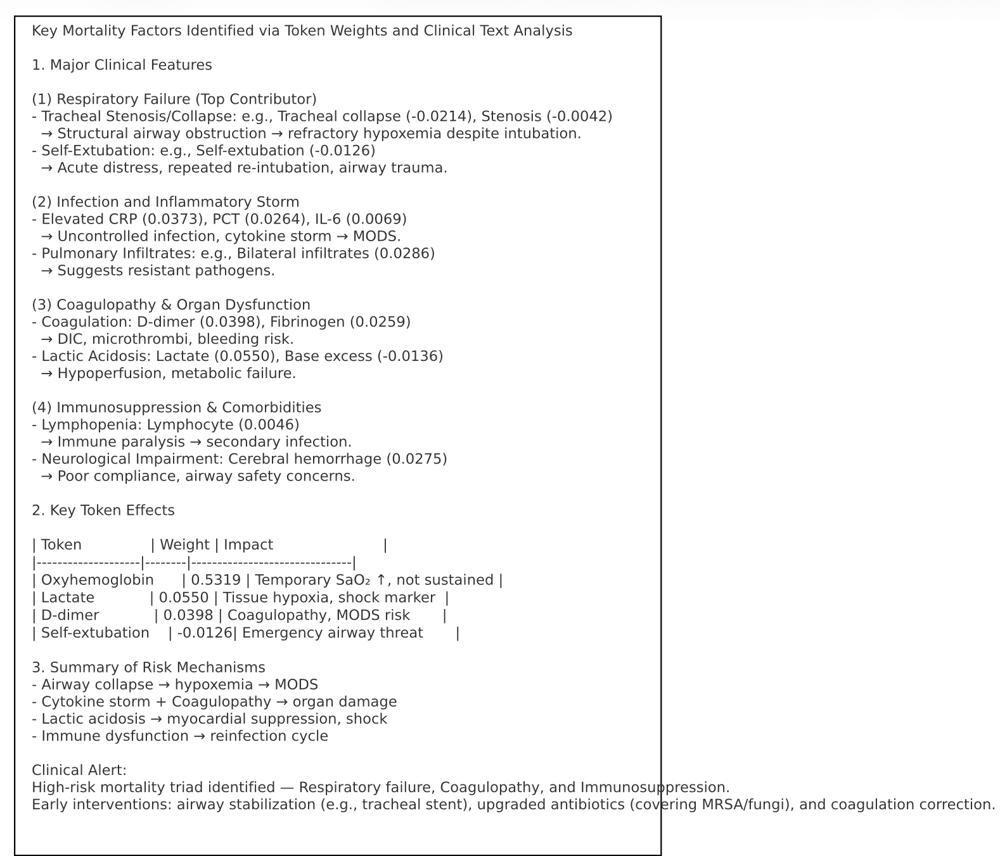
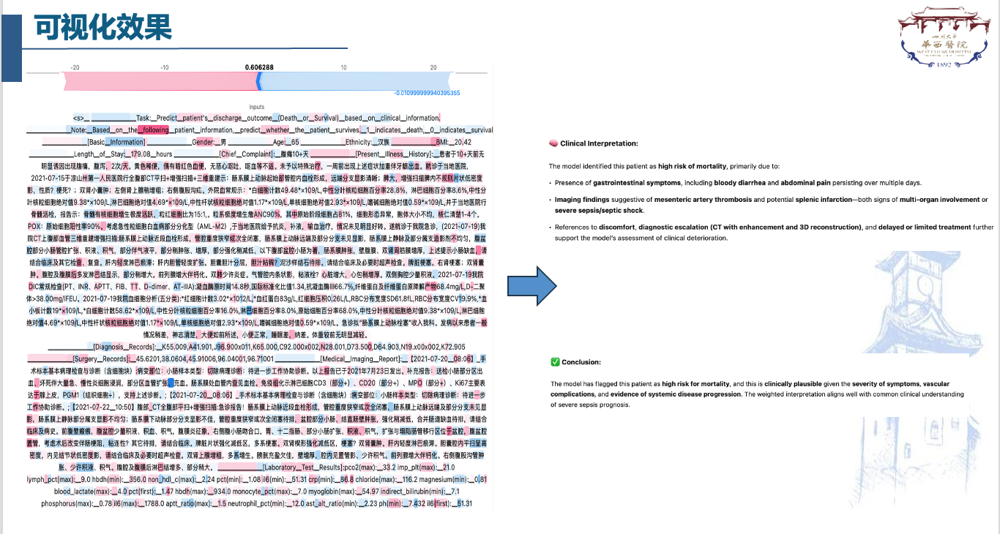

# Sepsis Combine 项目

项目用于训练与评估基于表示向量（representations）的下游二分类模型（感染/非感染或生存/死亡等），并提供可视化与解释工具（ROC、Loss/Accuracy 曲线、Integrated Gradients/SHAP 文本可视化）。

## 项目结构（部分）
- `main.py`：训练与评估主脚本，循环不同模型/数据路径并保存结果与曲线到 `Results/`。
- `DownstreamModel.py`：下游分类器模型定义（简单 MLP）。
- `my_dataset.py`：数据集加载与预处理（workspace 内存在，用于构造 DataLoader）。
- `token_explain.ipynb`：用于对输入 token 做 Integrated Gradients / SHAP 可视化的 notebook。

更多文件请查看仓库根目录。


## 环境依赖
- Python 3.8+
- PyTorch
- scikit-learn
- matplotlib
- tqdm
- captum
- modelscope
- shap
- numpy

建议使用虚拟环境并安装依赖，例如：

```bash
python -m venv .venv
source .venv/bin/activate
pip install -U pip
pip install torch scikit-learn matplotlib tqdm captum modelscope shap numpy
```

（根据你的平台与 CUDA/MPS 可用性选择合适的 `torch` 安装命令。）

## 快速开始 — 训练与评估
主脚本 `main.py` 接受若干参数来控制设备、批次大小、学习率等：

```bash
python main.py -device mps -batch_size 20 -lr 5e-5 -epochs 100 -early_stop 10
```

关键参数说明：
- `-device`：运行设备，如 `cpu`、`cuda` 或 `mps`（Mac M1/M2）。
- `-batch_size`：训练/验证/测试批次大小。
- `-lr`：优化器学习率。
- `-epochs`：最大训练轮数。
- `-early_stop`：验证损失不再下降时的早停轮数。

训练过程会在 `Results/` 下为每个数据路径创建子目录并保存 `best_model.pth` 以及 Loss/Accuracy 曲线图片。

## 解释与可视化
- 使用 `token_explain.ipynb` 可对单条样本做 Integrated Gradients 归因，并用 SHAP 的文本展示（notebook 中有示例流程）。
- 注意：不同脚本对 checkpoint 的保存/加载格式可能不同：`main.py` 直接保存 `model.state_dict()`，而部分 notebook 可能期望加载包含 `model_state_dict` 键的字典。若加载报错，请确认 checkpoint 格式或修改加载代码以匹配保存格式。

## 数据组织
- `Data/` 下按模型或表示来源组织（例如 `DeepSeek-R1-8B`、`Llama3.1-8B` 等），每个子目录通常包含 `train/`、`val/`、`test/` 的索引与表示文件。
- 还有用于特征选择与合并的 csv / jsonl 文件（例如 `processed_dataV2.jsonl`）。

## 常见问题
- 如果显存不足或训练失败，尝试减小 `-batch_size` 或切换到 `cpu`。
- 若使用 Mac 的 MPS，请确保 PyTorch 对 MPS 的支持和你的系统兼容。
- 若 notebook 中的 tokenizer 或 modelscope 调用失败，请先安装并配置 `modelscope` 与相应模型依赖。

## 下一步建议
- （可选）添加 `requirements.txt` 或 `environment.yml` 以便复现环境。
- 若希望统一 checkpoint 格式，考虑在 `main.py` 中改为保存包含键（例如 `{"model_state_dict": model.state_dict()}`）的字典，或在加载端做兼容处理。

---
如需我为仓库生成 `requirements.txt`、统一 checkpoint 保存/加载示例，或把 README 翻译为英文版，我可以继续帮你完成。
